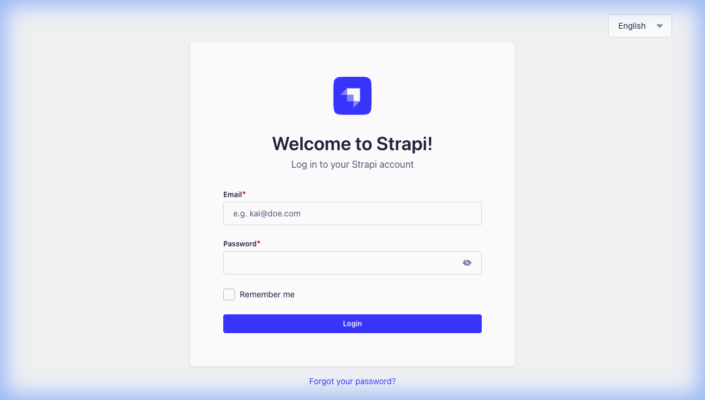

# Goon Co CMS

A Strapi CMS backend for the Goon Hiring Platform - a parody hiring platform for Kenyan content creators ("goons"). This CMS provides a comprehensive API for managing goons, their specialties, tools, reviews, and previous works.

## 📸 Screenshot



## 📚 Overview

This Strapi CMS serves as the content management system and API backend for the Goon-Co React Native application. It manages all content related to "goons" (Kenyan content creators) including their profiles, specialties, tools they use, reviews, and previous work portfolios.

### Content Types

The CMS includes the following content types:

#### 1. **Goon** (Main Content Type)

- **name**: String - The goon's display name
- **rating**: Decimal - Rating out of 5
- **price**: Decimal - Hourly rate
- **image**: Media - Profile picture
- **gender**: Enum - Male, Female, or Other
- **bodyType**: Enum - Slim, Athletic, Heavy, or Average
- **bio**: Text - Description of the goon
- **socialMediaUrl**: String (optional) - Link to social media profile
- **specialty**: Relation (One-to-One) - The goon's primary specialty
- **tools**: Relation (One-to-Many) - Tools/skills the goon uses
- **reviews**: Relation (One-to-Many) - Client reviews
- **previousWorks**: Relation (One-to-Many) - Portfolio items

#### 2. **Specialty**

- **name**: String - Specialty name (e.g., "Content Creation", "Photography")
- **icon**: String - Icon identifier

#### 3. **Tool**

- **name**: String - Tool/skill name (e.g., "Adobe Premiere", "Final Cut")
- **icon**: String - Icon identifier
- **goon**: Relation (Many-to-One) - Associated goon

#### 4. **Review**

- **Reviewer details and content**
- **goon**: Relation (Many-to-One) - Associated goon

#### 5. **Previous Work**

- **Portfolio item details**
- **goon**: Relation (Many-to-One) - Associated goon

## 🛠️ Tech Stack

- **Strapi**: v5.33.1 (Headless CMS)
- **Node.js**: v20.0.0 - v24.x.x
- **Database**: SQLite (Development) - easily configurable for PostgreSQL, MySQL, etc.
- **TypeScript**: Type-safe development
- **React**: v18 (Admin Panel)

## 🚀 Setup Instructions

### Prerequisites

Before setting up the CMS, ensure you have the following installed:

- **Node.js**: Version 20.0.0 or higher (recommended: v22.11.0)
- **npm**: Version 6.0.0 or higher
- **Git**: For version control

### Installation

1. **Clone the repository** (if not already done):

   ```bash
   git clone <repository-url>
   cd goon-co-cms
   ```

2. **Install dependencies**:

   ```bash
   npm install
   ```

3. **Configure environment variables**:

   Copy the example environment file:

   ```bash
   cp .env.example .env
   ```

   Open `.env` and update the following values with secure random strings:

   ```env
   HOST=0.0.0.0
   PORT=1337
   APP_KEYS="<generate-random-key1>,<generate-random-key2>"
   API_TOKEN_SALT=<generate-random-salt>
   ADMIN_JWT_SECRET=<generate-random-secret>
   TRANSFER_TOKEN_SALT=<generate-random-salt>
   JWT_SECRET=<generate-random-secret>
   ENCRYPTION_KEY=<generate-random-key>
   ```

   > **Tip**: You can generate secure random strings using:
   >
   > ```bash
   > node -e "console.log(require('crypto').randomBytes(32).toString('base64'))"
   > ```

4. **Start the development server**:

   ```bash
   npm run dev
   ```

   The server will start at `http://localhost:1337`

5. **Create your admin account**:

   On first launch, navigate to `http://localhost:1337/admin` and you'll be prompted to create an admin account. Fill in:

   - First name and last name
   - Email address
   - Password (must be strong)

6. **Access the admin panel**:

   After creating your account, you can log in at `http://localhost:1337/admin`

### Initial Data Setup

After logging in, you'll need to populate the CMS with initial data:

1. **Create Specialties**:

   - Navigate to Content Manager → Specialties
   - Add specialties like "Content Creation", "Photography", "Videography", etc.

2. **Create Tools**:

   - Navigate to Content Manager → Tools
   - Add tools like "Adobe Premiere", "Final Cut Pro", "Photoshop", etc.

3. **Create Goons**:

   - Navigate to Content Manager → Goons
   - Add goon profiles with all required fields
   - Upload profile images
   - Link to their specialties and tools

4. **Add Reviews and Previous Works** (Optional):
   - Create reviews for goons
   - Add portfolio items under Previous Works

### API Configuration

To allow the React Native app to access the API:

1. **Configure API Permissions**:

   - Go to Settings → Users & Permissions Plugin → Roles → Public
   - Enable the following permissions for public access:
     - **Goon**: `find`, `findOne`
     - **Specialty**: `find`, `findOne`
     - **Tool**: `find`, `findOne`
     - **Review**: `find`, `findOne`
     - **Previous-work**: `find`, `findOne`
   - Click Save

2. **Configure CORS** (if needed):
   - Edit `config/middlewares.ts` or `config/middlewares.js`
   - Update CORS settings to allow requests from your React Native app

## 📝 Available Scripts

- **`npm run dev`** or **`npm run develop`**: Start Strapi in development mode with auto-reload
- **`npm start`**: Start Strapi in production mode
- **`npm run build`**: Build the admin panel for production
- **`npm run strapi`**: Access Strapi CLI commands
- **`npm run upgrade`**: Upgrade Strapi to the latest version

## 🔗 API Endpoints

Once running, the API is available at:

- **Base URL**: `http://localhost:1337/api`
- **Goons**: `GET /api/goons` (list all), `GET /api/goons/:id` (single goon)
- **Specialties**: `GET /api/specialties`
- **Tools**: `GET /api/tools`
- **Reviews**: `GET /api/reviews`
- **Previous Works**: `GET /api/previous-works`

### Query Parameters

Strapi supports powerful query parameters for filtering, sorting, and populating relations:

```
# Get all goons with their specialty and tools
GET /api/goons?populate=specialty,tools

# Filter by gender
GET /api/goons?filters[gender][$eq]=Male

# Filter by specialty
GET /api/goons?filters[specialty][name][$eq]=Photography

# Sort by rating
GET /api/goons?sort=rating:desc
```

## 🔒 Security Notes

- **Never commit your `.env` file** to version control
- **Generate strong, unique secrets** for production
- **Regularly update dependencies** with `npm audit fix`
- **Use a production database** (PostgreSQL, MySQL) in production instead of SQLite
- **Enable HTTPS** in production
- **Implement rate limiting** for API endpoints

## 🚢 Deployment

For production deployment, consider:

1. **Strapi Cloud**: Official Strapi hosting platform
2. **Heroku**: Easy deployment with PostgreSQL addon
3. **DigitalOcean/AWS/GCP**: VPS or container-based deployment
4. **Vercel/Netlify**: Frontend-focused platforms

Before deploying:

- Set `NODE_ENV=production`
- Configure a production database
- Run `npm run build` to build the admin panel
- Use `npm start` to run in production mode

## 🔗 Related Projects

- **Goon-Co Mobile App**: [Link to React Native repository]

  This is the React Native mobile application that consumes this API. It provides a Tinder-like interface for browsing and "hiring" goons.

## 📚 Learn More

- [Strapi Documentation](https://docs.strapi.io)
- [Strapi REST API](https://docs.strapi.io/dev-docs/api/rest)
- [Content Type Builder](https://docs.strapi.io/user-docs/content-type-builder)
- [Strapi Deployment Guide](https://docs.strapi.io/dev-docs/deployment)

## 🤝 Contributing

This is a parody project for Kenyan content creators. Feel free to contribute by:

- Adding more goon profiles
- Improving the content types
- Enhancing the API
- Reporting bugs

## 📄 License

See [license.txt](./license.txt) for details.

---

**Built with Strapi** - The leading open-source headless CMS
